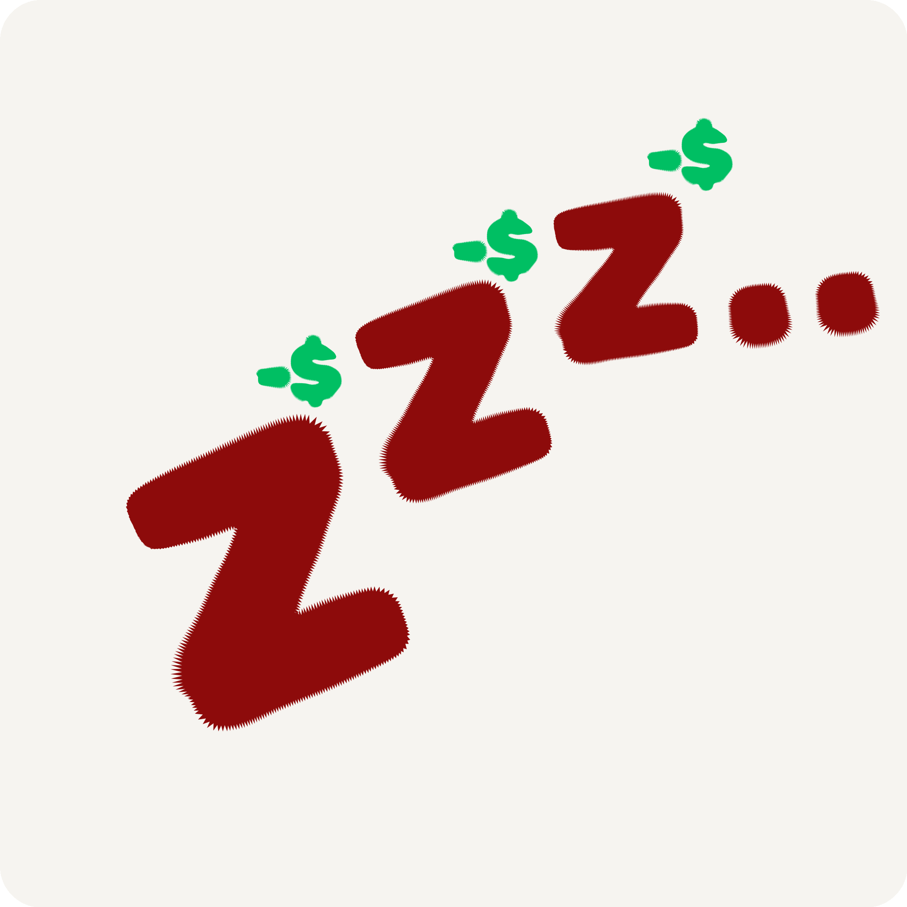

 

<h1> 𝘞𝘢𝘬𝘦 𝘶𝘱. 𝘗𝘳𝘰𝘷𝘦 𝘪𝘵. 𝘖𝘳 𝘱𝘢𝘺 𝘧𝘰𝘳 𝘪𝘵. 

 

### ✨ About

SleepTax makes waking up have real consequences. Set one alarm, pick your wake up challenge, and when it rings you have to prove you are actually up. If you don't complete the challenge a penalty hits. What the challenge looks like is completely up to you.

 

### 🚀 Features

| Feature | Description |
|---|---|
| ⏰ **One Alarm** | Just one. No snooze, no backup plan. |
| 💪 **Wake Up Challenge** | Complete a challenge when the alarm rings to prove you are actually awake. |
| ⚙️ **Configurable Challenge** | You set what the challenge is. Everyone's wake up is different. |
| 💸 **Penalty System** | Fail the challenge and face a real consequence. Waking up starts to matter. |

 

### 🐶 Say Hi !!, I dont bite

 

### 📸 Screenshots

 

